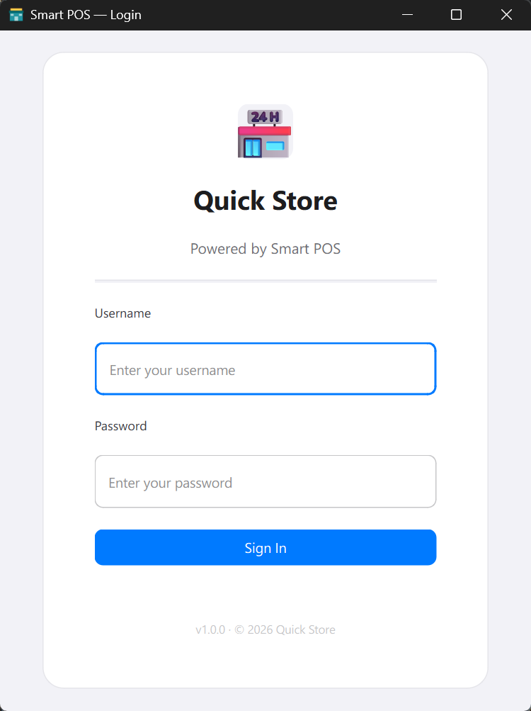
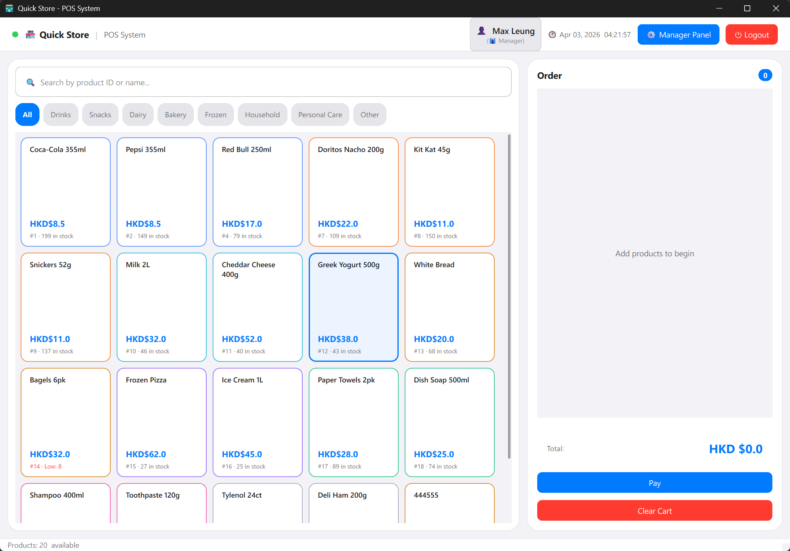
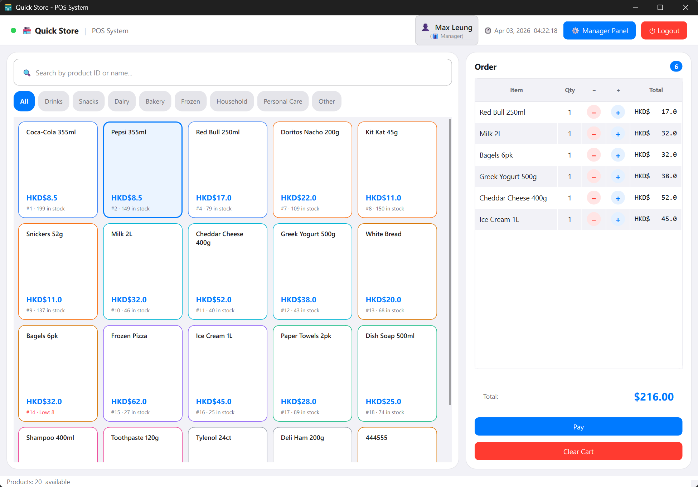
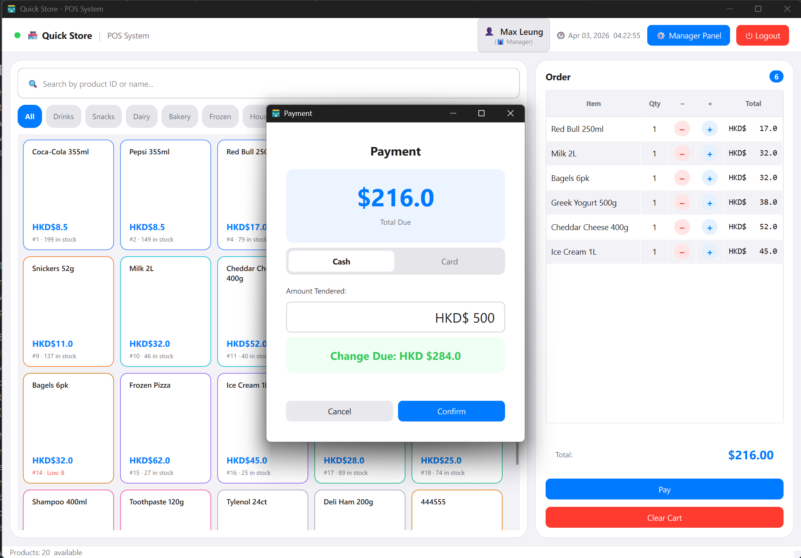
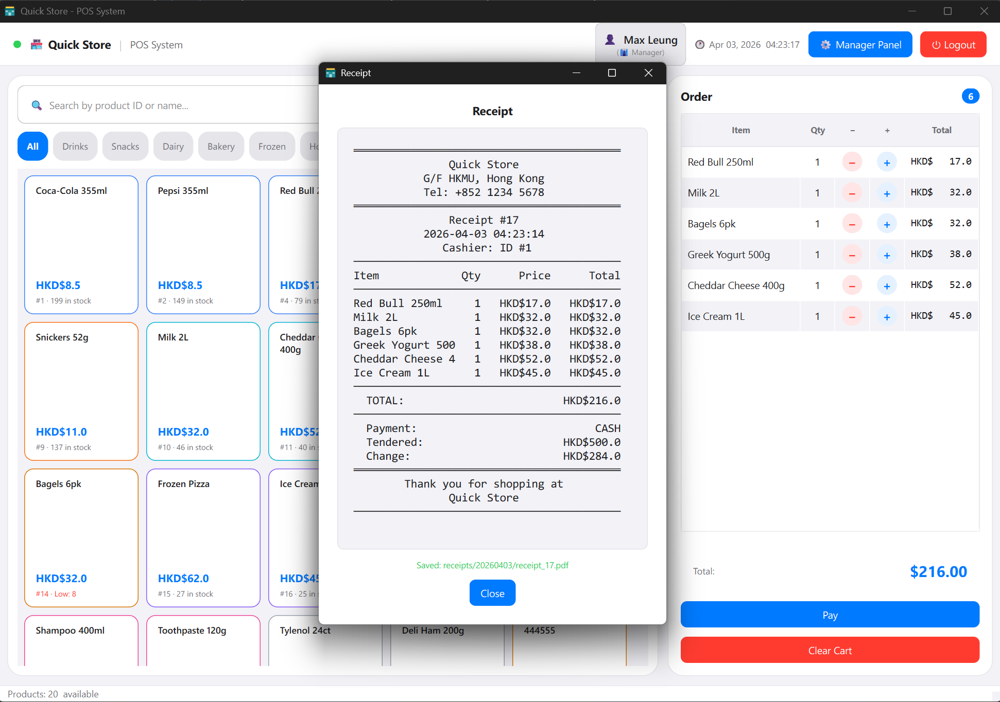
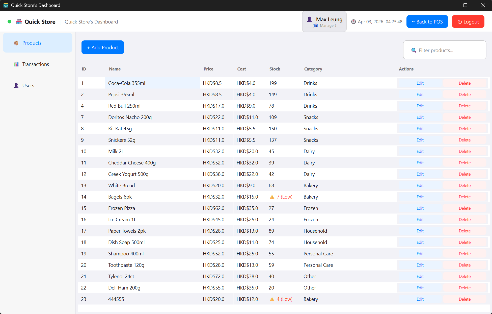
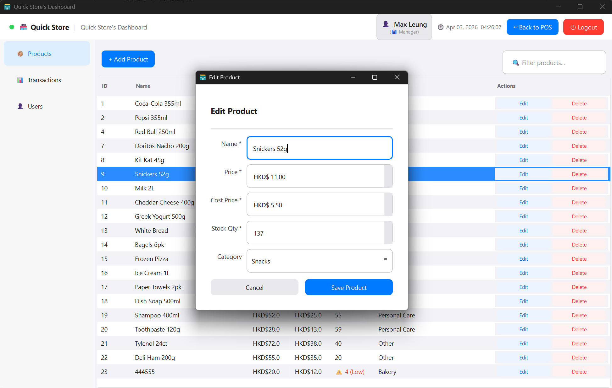
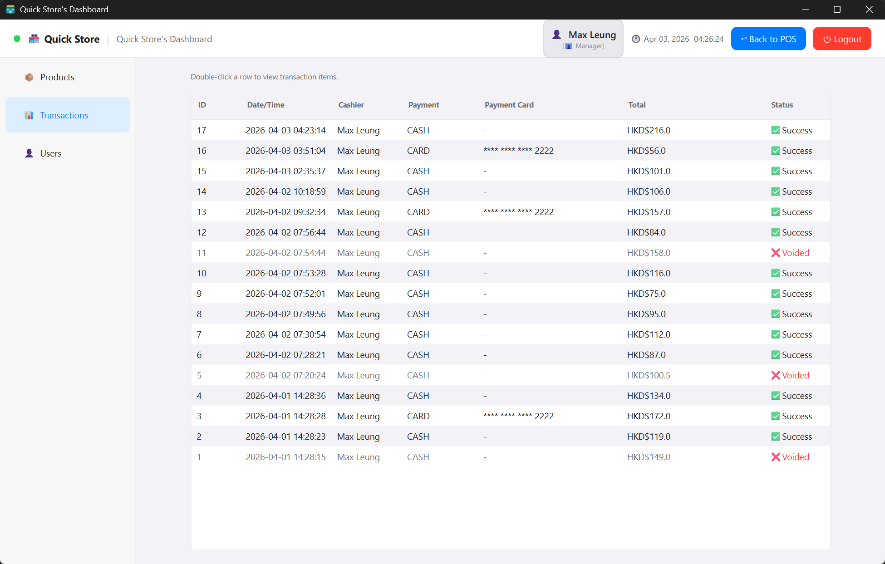
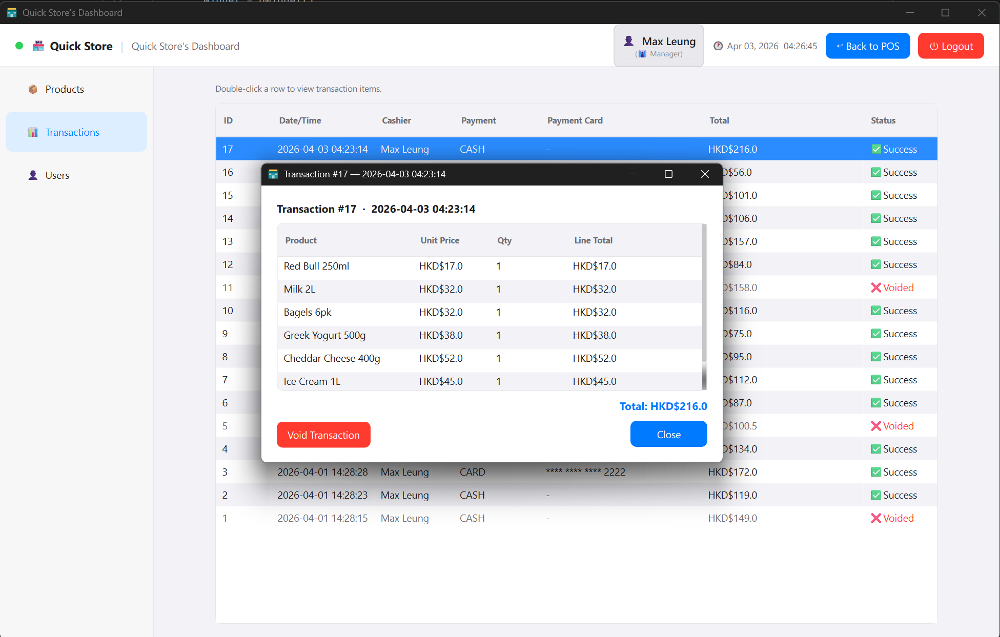
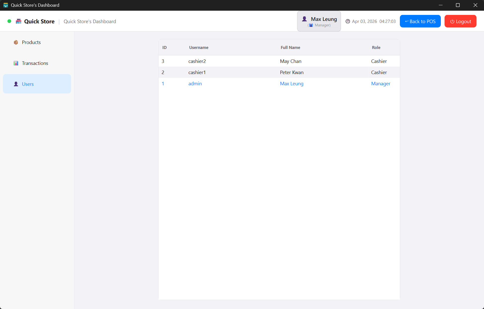

# 🛒 Smart POS

A GUI-based Point of Sale (POS) system for small retail stores, built with Python and PySide6. Supports cash and card payments, role-based access control, real-time inventory management, and automatic PDF receipt generation.

---

## 📸 Screenshots

### POS Workflow

| 🔐 Login Screen | 🛍️ Main POS Window |
|---|---|
|  |  |

| 🛒 Add to Cart | 💳 Payment Dialog |
|---|---|
|  |  |

| 🧾 Receipt Viewer                                              | |
|----------------------------------------------------------------|---|
|  | |

### 📊 Manager Dashboard

| 📦 Product Management | ✏️ Edit Product |
|---|---|
|  |  |

| 📋 Transaction History | 🔍 Transaction Line Items |
|---|---|
|  |  |

| 👥 User Management | |
|---|---|
|  | |

---

## ✨ Features

| Feature | Description |
|---|---|
| 🔐 User Authentication | Secure login with bcrypt-hashed passwords — plain-text passwords are never stored |
| 👤 Role-Based Access Control | Managers get full dashboard access; Cashiers are restricted to the POS sales screen |
| 🔎 Product Browsing | Browse products with real-time category filtering and keyword search |
| 🛒 Shopping Cart | Add/remove items with live stock validation to prevent overselling |
| 💳 Payment Processing | Supports both cash (with change calculation) and card payment flows |
| 🧾 PDF Receipt Generation | Automatically generates a formatted receipt after every successful checkout |
| 📦 Product Management | Managers can add, edit, and delete products including price and stock levels |
| 📋 Transaction History | Full audit log of all completed sales with expandable line-item detail |
| ↩️ Void Transactions | Managers can void any transaction and stock is automatically restored |
| 👥 User Account Management | Managers can create, edit, and remove cashier and manager accounts |

---

## ⚙️ Prerequisites

Before installing, ensure the following are available on your machine:

| Requirement | Version | Notes |
|---|---|---|
| 🐍 Python | 3.12+ | Earlier versions are **not** supported (`Self` type hint requires 3.11+) |
| 💻 OS | Windows / macOS / Linux | Windows recommended; tested on Windows 11 |
| 🧰 UV or Conda | Any recent version | See [Installation](#-installation--running) below |

> **Windows users:** The pre-built `SmartPOS.exe` requires no Python installation at all — see [Build a Standalone Executable](#%EF%B8%8F-build-a-standalone-executable-pyinstaller).

---

## 🧰 Tech Stack

| Component | Technology |
|---|---|
| 🐍 Language | Python 3.12 |
| 🖥️ GUI Framework | PySide6 (Qt 6) |
| 🗄️ Database | SQLite (via `sqlite3` stdlib) |
| 🔒 Password Hashing | bcrypt |
| 📦 Build Tool | PyInstaller |

---

## 🏛️ Architecture & Design Patterns

The system follows a layered architecture with clear separation between GUI, business logic, and data access. Several classical OOP design patterns are applied throughout.

### Layered Architecture

```
┌─────────────────────────────────────────┐
│               GUI Layer                 │  PySide6 windows, dialogs, widgets
├─────────────────────────────────────────┤
│             Service Layer               │  Business logic (auth, cart, products…)
├─────────────────────────────────────────┤
│              Model Layer                │  Domain objects (User, Product, Transaction…)
├─────────────────────────────────────────┤
│           Database Layer                │  Singleton SQLite wrapper (DatabaseManager)
└─────────────────────────────────────────┘
```

### Design Patterns

| Pattern | Where Used | Purpose |
|---|---|---|
| **Singleton** | `DatabaseManager` | Ensures a single shared SQLite connection throughout the application lifetime |
| **Abstract Base Class (ABC)** | `BaseModel`, `PaymentMethod` | Enforces a `from_db_row()` factory on every model; enforces `process_payment()` on every payment type |
| **Strategy** | `CashPayment` / `CardPayment` → `PaymentMethod` | Swaps payment behaviour at runtime without changing the calling code; open to new payment types without modification (Open/Closed Principle) |
| **Factory Method** | `User.from_db_row()` | Returns a `Manager` or `Cashier` subclass instance based on the `role` column — callers work against the `User` interface and get role-specific behaviour polymorphically |
| **Service Layer** | `AuthService`, `CartService`, `ProductService`, `TransactionService`, `UserService` | Keeps all business logic out of the GUI; each service owns one domain area |

### Class Hierarchy

```
BaseModel (ABC)
├── User
│   ├── Manager       — has MANAGE_PRODUCTS + MANAGE_USERS permissions
│   └── Cashier       — POS sales only
├── Product
├── Category
├── Transaction
└── TransactionItem

PaymentMethod (ABC)
├── CashPayment       — validates tendered amount, calculates change
└── CardPayment       — mocked gateway, stores last-4 card digits
```

---

## 🗄️ Database Schema

Five tables, all created automatically on first launch via `DatabaseManager._create_tables()`.

```
categories
  PK  category_id
      name

products
  PK  product_id
      name
      price
      cost_price
      stock_quantity
      is_active
  FK  category_id        →  categories.category_id  (SET NULL on delete)

users
  PK  user_id
      username
      password_hash
      full_name
      role               CHECK ('cashier' | 'manager')

transactions
  PK  transaction_id
      timestamp
  FK  cashier_id         →  users.user_id            (SET NULL on delete)
      total_amount
      payment_type
      amount_tendered
      change_due
      card_last_four
      is_void

transaction_items
  PK  transaction_item_id
  FK  transaction_id     →  transactions.transaction_id  (CASCADE on delete)
  FK  product_id         →  products.product_id          (SET NULL on delete)
      product_name       ← snapshot of name at sale time
      quantity
      unit_price
      line_total
```

**Key design decisions:**
- `transaction_items.product_name` snapshots the product name at sale time so historical receipts remain accurate even if the product is later renamed or deleted.
- Foreign keys use `ON DELETE SET NULL` (not `CASCADE`) on `cashier_id` and `product_id` so that deleting a user or product never erases historical transaction data.
- `is_void` flag on `transactions` soft-deletes a sale and triggers stock restoration rather than hard-deleting the row.

---

## 🔑 Default Accounts

The database is seeded automatically on first launch with the following accounts:

| Role | Username | Password |
|---|---|---|
| 👔 Manager | `admin` | `admin123` |
| 💼 Cashier | `cashier1` | `cash123` |
| 💼 Cashier | `cashier2` | `cash123` |

> 👔 Managers have full access to the Dashboard (products, transactions, users).
> 💼 Cashiers can only process sales on the main POS window.

---

## 🚀 Installation & Running

### Option 1 — UV (Recommended)

[UV](https://docs.astral.sh/uv/getting-started/installation/) handles virtualenv and dependencies in one step.

```bash
# Install UV (if not already installed)
# Windows (PowerShell)
powershell -ExecutionPolicy ByPass -c "irm https://astral.sh/uv/install.ps1 | iex"
# macOS / Linux
curl -LsSf https://astral.sh/uv/install.sh | sh

# Sync dependencies and run
uv sync
uv run main.py
```

### Option 2 — Conda

```bash
# Create a virtual environment (Python 3.12 required)
conda create -n smart-pos python=3.12

# Activate the environment and install dependencies
conda activate smart-pos
pip install -r requirements.txt

# Run the application
python main.py
```
---

## 🏗️ Build a Standalone Executable (PyInstaller)

A pre-configured `SmartPOS.spec` file is included so you can produce a single self-contained `.exe` without any extra flags.

### Prerequisites

```bash
# with conda
pip install pyinstaller

# or with UV dev dependencies
uv sync --group dev
```

### Build

Run the following command from the `Task1/` directory:

```bash
# with conda
pyinstaller SmartPOS.spec

# or with UV dev dependencies
uv run pyinstaller SmartPOS.spec
```

The finished executable is written to:

```
Task1/dist/SmartPOS.exe
```

Double-click `SmartPOS.exe` to launch — no Python installation required on the target machine. The database file (`smartpos.db`) is created automatically next to the executable on first run.

### What the spec does

- **Entry point:** `main.py`
- **Mode:** `--onefile` (single bundled executable, no `_internal/` folder)
- **Console:** hidden (windowed GUI only, no terminal window)
- **Bundled assets:** `asset/store_icon.ico` (window and taskbar icon)
- **UPX compression:** enabled (reduces file size)

---

## ⚠️ Known Limitations

| Area | Limitation |
|---|---|
| 🖥️ Single terminal | No multi-terminal or networked POS support — all sales run on one machine |
| 💱 Currency | Hardcoded to HKD (HKD$); no multi-currency support |
| 💳 Card payments | Card processing is mocked (`sleep(1)` + always approves) — no real payment gateway integration |
| 📊 Reporting | No sales summary, daily totals, or profit/loss reports |
| 📧 Digital receipts | Receipts are PDF only — no email or SMS delivery |
| 🔄 Concurrency | SQLite WAL mode is enabled but the app is single-process; not suitable for simultaneous multi-user access |
| 🌐 No cloud sync | Database is local only; no backup or remote-sync mechanism |
| ♿ Accessibility | No screen-reader support or keyboard-only navigation beyond standard Qt defaults |

---

## 🔮 Future Work

| Enhancement | Description |
|---|---|
| 🌐 REST API backend | Replace direct SQLite calls with a FastAPI / Django REST backend to support multi-terminal deployments |
| 💳 Real payment gateway | Integrate Stripe or a local POS SDK for actual card processing |
| 📊 Sales dashboard | Add charts for daily/weekly revenue, top-selling products, and low-stock alerts |
| 📧 Email receipts | Send PDF receipts directly to customers via SMTP |
| 🔄 Cloud backup | Periodic sync of `smartpos.db` to cloud storage (e.g. S3, Google Drive) |
| 🌍 Multi-currency | Support configurable store currency and exchange rates |
| 🧾 Discount & promotions | Apply item-level or cart-level discount codes |
| 🏷️ Barcode scanning | Integrate USB barcode scanner for faster product lookup |

---

---

## 📁 Project Structure

```
Task1/
├── main.py                     # Application entry point (App class)
├── config.py                   # Global constants (DB path, store info, colours)
├── exceptions.py               # Custom domain exceptions
├── pyproject.toml              # Project metadata (UV)
├── requirements.txt            # pip-compatible dependency list
├── SmartPOS.spec               # PyInstaller build specification
│
├── asset/
│   ├── store_icon.ico          # Application icon
│   └── screen/                 # Screenshots
│
├── constant/
│   ├── enums.py                # UserRole, PaymentType enums
│   ├── permission.py           # RBAC permission definitions
│   └── constants.py            # UI display constants
│
├── database/
│   ├── db_manager.py           # Singleton SQLite connection wrapper
│   └── seed_data.py            # Default categories, users, and products
│
├── models/
│   ├── base.py                 # Abstract BaseModel (ABC)
│   ├── cart_item.py            # Shopping cart line item (dataclass)
│   ├── category.py             # Product category model
│   ├── payment_method.py       # Abstract PaymentMethod + CashPayment / CardPayment
│   ├── product.py              # Product model
│   ├── receipt.py              # Receipt text generator
│   ├── transaction.py          # Completed transaction record
│   ├── transaction_item.py     # Transaction line item
│   └── user.py                 # User / Manager / Cashier hierarchy
│
├── services/
│   ├── auth_service.py         # Login authentication
│   ├── cart_service.py         # Shopping cart logic
│   ├── category_cache.py       # In-memory category cache
│   ├── product_service.py      # Product CRUD
│   ├── transaction_service.py  # Transaction persistence and void logic
│   └── user_service.py         # User account management
│
├── gui/
│   ├── login_window.py         # Login screen
│   ├── main_window.py          # Main POS window
│   ├── dashborad_window.py     # Admin dashboard
│   ├── styles.py               # Global stylesheet and colour palette
│   ├── dialogs/
│   │   ├── payment_dialog.py   # Cash / card payment dialog
│   │   ├── product_dialog.py   # Add / edit product dialog
│   │   └── receipt_dialog.py   # Receipt viewer + PDF save
│   └── widgets/
│       ├── hkd_line_edit.py    # Currency input with fixed HKD$ prefix
│       ├── product_card.py     # Clickable product card widget
│       └── top_bar.py          # Navigation bar with live clock
│
└── utils/
    ├── category_color.py       # Maps category to hex colour
    ├── password_utils.py       # bcrypt hash and verify helpers
    ├── path_utils.py           # Resolves asset paths (source + PyInstaller)
    └── validators.py           # Input validation static methods
```
