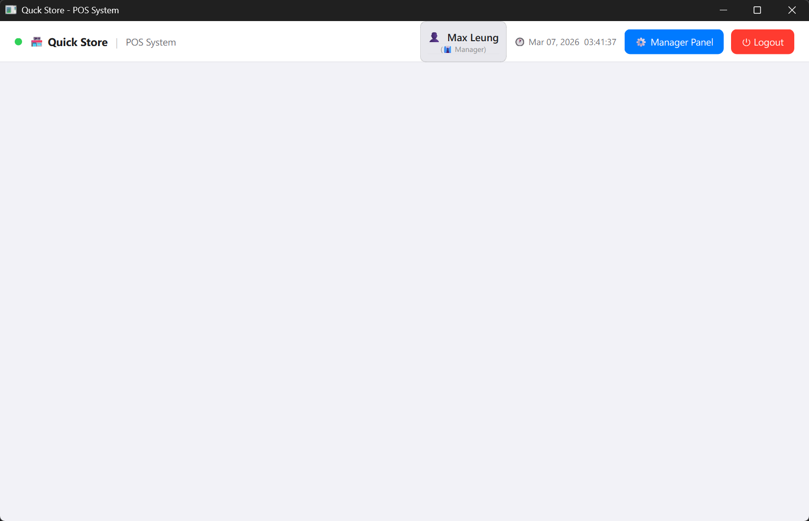

# 🛒 Smart POS

A GUI-based Point of Sale (POS) system for small stores and retailers, built with Python and PySide6.

---

## 📸 Screenshots

| Login Screen | Main Window |
|---|---|
|  |  |

---

## ✨ Features

| Feature | Status |
|---|---|
| 🔐 User authentication | ✅ Implemented |
| 👥 Role-based access control | ✅ Implemented |
| 🛍️ Sell products | 🚧 WIP |
| 🧾 Generate receipt | 🚧 WIP |
| 📦 Manage inventory | 🚧 WIP |
| 📊 Manage sale reports | 🚧 WIP |

---

## 🧰 Tech Stack

- **Language:** Python 3.12
- **GUI Framework:** PySide6
- **Database:** SQLite
- **Password Hashing:** bcrypt

---

## 🚀 Installation

### ⚡ UV (Recommended)

1. Install UV: https://docs.astral.sh/uv/getting-started/installation/

2. Sync dependencies and run:
   ```bash
   uv sync
   uv run main.py
   ```

### 🐍 Conda / pip

1. Create and activate a conda environment:
   ```bash
   conda create -n smart-pos python=3.12
   conda activate smart-pos
   ```

2. Install dependencies:
   ```bash
   pip install -r requirements.txt
   ```

3. Run the application:
   ```bash
   python main.py
   ```

---

## 🏗️ Project Status

> ⚠️ **This project is currently under active development and is not yet complete.**
> Some features listed above are still work-in-progress.

---

## 📁 Project Structure

```
task1/
├── asset/                  # Screenshots and static assets
├── main.py                 # Application entry point
├── pyproject.toml          # UV project configuration
├── requirements.txt        # pip-compatible dependencies
└── README.md
```
